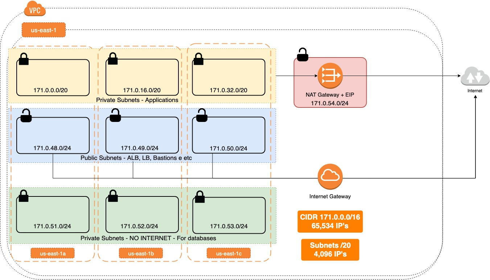

<h1 align="center">Welcome to AWS VPC Best Pratices 👋</h1>
<p>
  
  <a href="https://github.com/msfidelis/tempo">
    
  </a>
  <a href="https://github.com/msfidelis/tempo">
    
  </a>
  <a href="https://twitter.com/fidelissauro">
    
  </a>
</p>

> Personal compilation for best practices for VPC Network architectures on AWS to improve performance, high availability and security for your apps

### 🏠 [Homepage](https://github.com/msfidelis/aws-vpc-best-pratices)

## Network Tips



### Using two or more AZ's for high availability

* Deploy your services and applications on two or more Availability zone on AWS
* This prevent total outage into your application in case of AWS failures
* This is helps you on spot requests
* Enable Multi A-Z on Elasticache and RDS instances
* Create read replicas to your databases in a different AZ's

### Don't use main route table

* The main route table controls the default traffic from your VPC network. For more control and compliance management, don't use it.
* The main route table is recommended to simple and low scope architectures.
* For more complex and compliance environment, the recommendation are create your on route tables with your rules from internet and additional VPC Peering links.


### Deploy public subnets on all AZ's

* Network Load Balancers and Some Network functions needs a public subnets deployed to works fine.
* If you deploy an ALB to balance the traffic between your instances or containers, technically AWS will deploy that service to a public subnet in each Availability Zone you choose to route.
* This publics subnets can be used to deploy bastion hosts, third-part applications, satellite services like monitoring systems, CI/CD Pipeline, Big Data Services to support teams and business dynamically/


### Applications on Private Subnets

* Containers, EC2 should not have accessed directly from the Internet by public IP's.
* The application layer must be served by a single access point, such as an Application Load Balancer, Classic Load Balancer, or Network Load Balancer.
* Nginx, HAProxy, Ingress Controllers, API Gateways, ALB, ELB, NLB deployed on Public Subnets must route all DMZ access to private subnets


### VPC Endpoints for AWS Services

* Crete VPC Endpoint to consume AWS services without using a Internet Gateway or NAT Gateway with Internet Access.

* VPC Endpoints can be used to improve latency performance with security with common AWS services like S3, API Gateway, SQS, ECR, SNS, DynamoDB and Load Balancers.

* You can create a microservices gateway using VPC Endpoints for ALB and API Gateway


### Route all outbound traffic from private subnets to a NAT Gateway

* Creating routing rules of all outbound traffic from the network to a NAT Gateway, you can enjoy a fixed outgoing IP
* Fixed outbound IPs can help you identify with third-party gateways, partners, friendly firewalls, and IPsec connections for Multicloud.


### Databases subnets with no internet direct access

* For compliance management, your databases, cache layers and data warehouses like RDS, Elasticache, Elasticsearch, DB's on EC2, Redshift, Bigdata Stacks should be deployed on a segmented subnets without access to internet.
* No data should be accessed directly from the internet., only by applications deployed on your VPC.
* For multicloud, the recommendations are create a IPsec Connections or VPN Connections site-to-site.


### VPC Flow Logs

*
*
*


### Network ACL's and Security Group

* Block all outside traffic to private subnets and allow traffic only by VPC IP Range
* Block all egress traffic from database subnets
* Only allow public subnet ingress to really useful public ports, like 80, 443, 22 etc.


### Cloudfront for Content Distribution on DMZ

* 
* 
* 

### Enable AWS WAF on your Load Balancers, Cloudfront  Distribuitions or API Gateways

* 
* 
* 

# Terraform Example

## Install

```sh
terraform init
```

## Usage

```sh
terraform apply
```

## Run tests

```sh
terraform plan
```

## Author

👤 **Matheus Fidelis**

* Twitter: [@fidelissauro](https://twitter.com/fidelissauro)
* Github: [@msfidelis](https://github.com/msfidelis)

## 🤝 Contributing

Contributions, issues and feature requests are welcome!<br />Feel free to check [issues page](https://github.com/msfidelis/aws-vpc-best-pratices/issues).

## Show your support

Give a ⭐️ if this project helped you!

## 📝 License

Copyright © 2019 [Matheus Fidelis](https://github.com/msfidelis).<br />
This project is [MIT](https://github.com/msfidelis/aws-vpc-best-pratices/blob/master/LICENSE) licensed.

***
_This README was generated with ❤️ by [readme-md-generator](https://github.com/kefranabg/readme-md-generator)_
